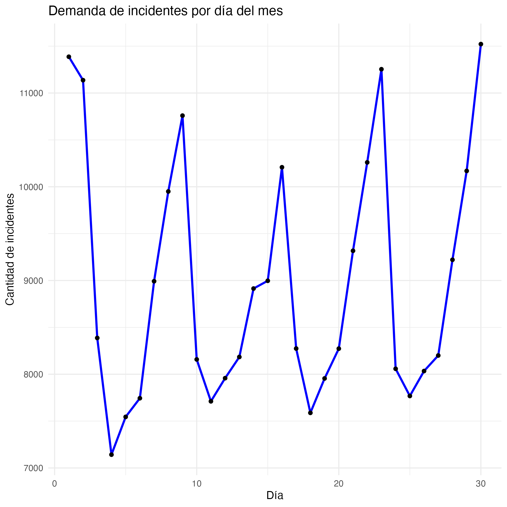
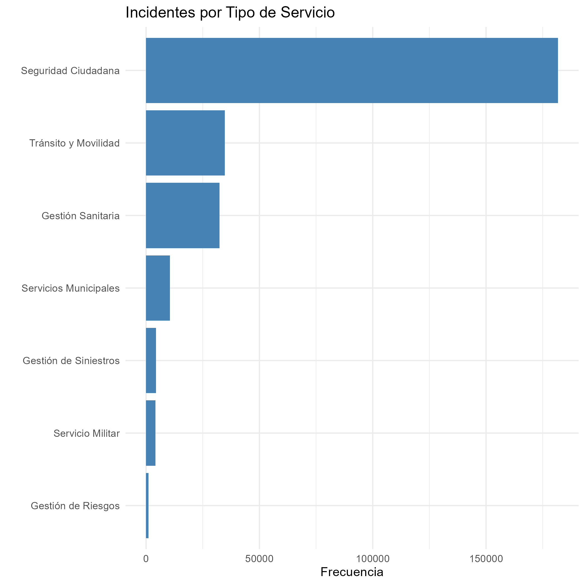
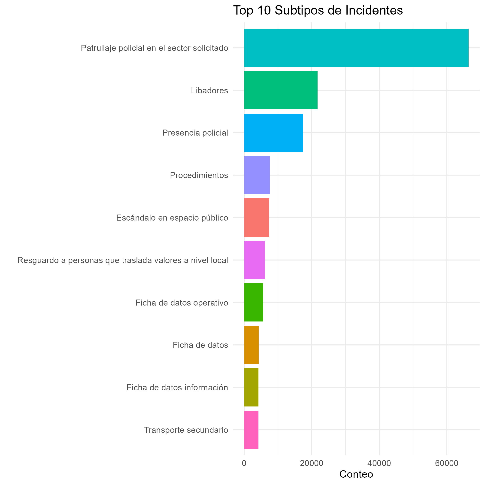
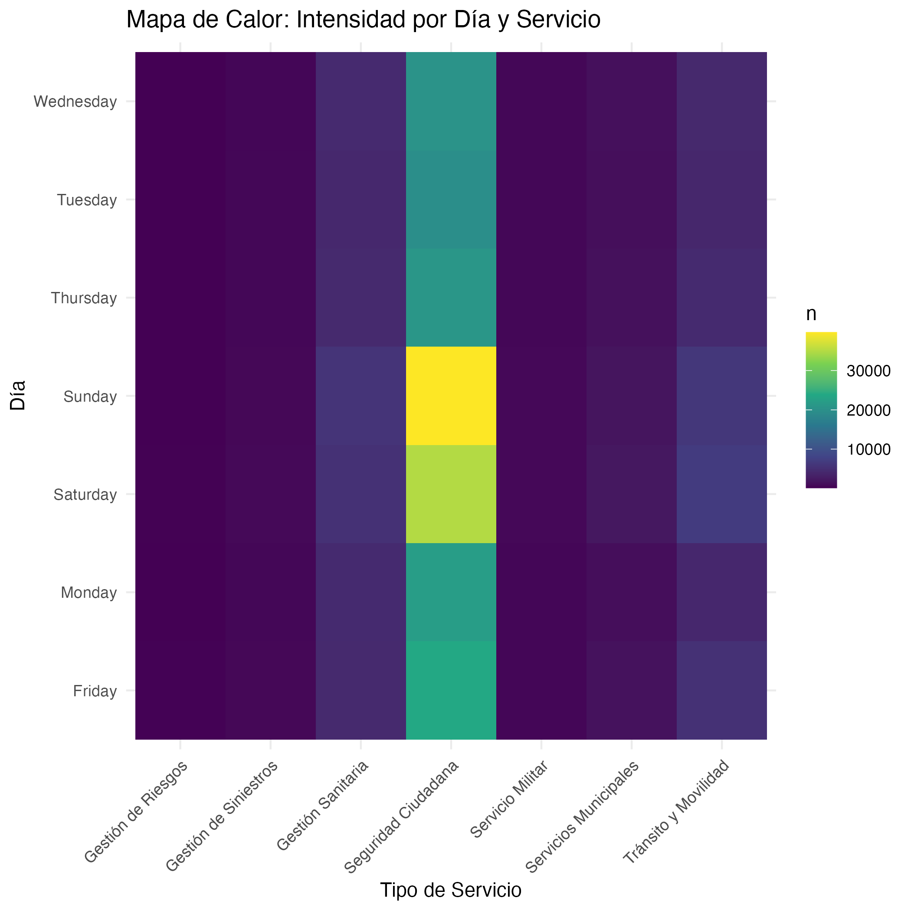
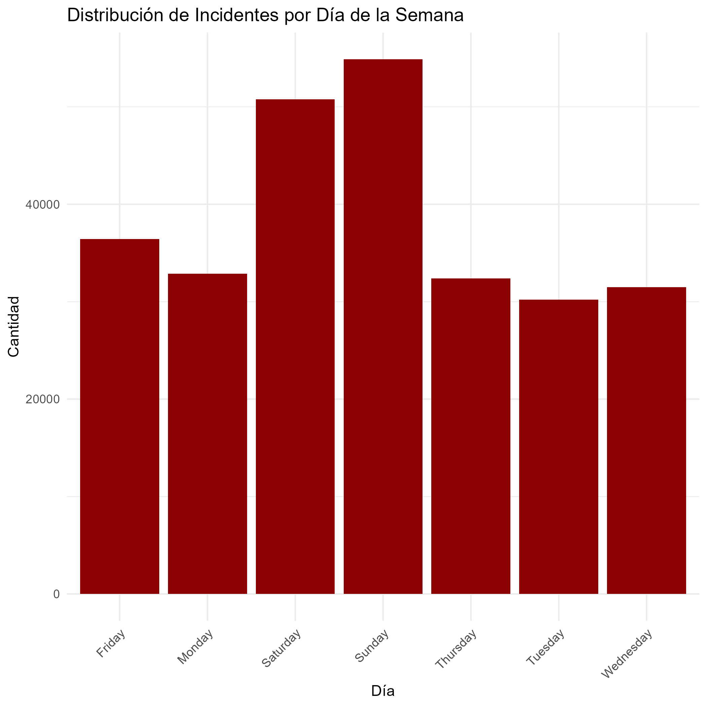
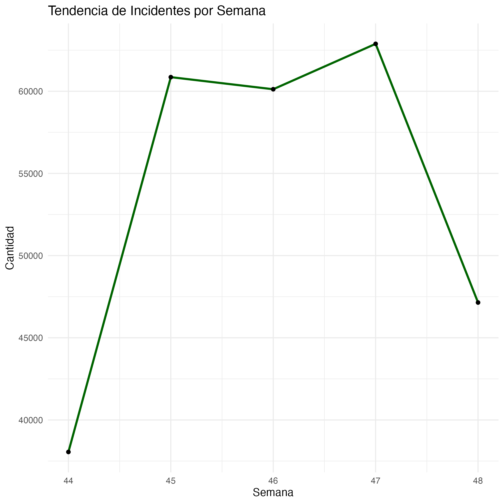

```{r setup, include=FALSE}
knitr::opts_chunk$set(echo = FALSE, message = FALSE, warning = FALSE)
library(tidyverse)
library(jsonlite)
```

# 1. Introducción y Limpieza de Datos

El objetivo de este avance es procesar los datos de llamadas de
emergencia del ECU 911 (Noviembre 2025) para parametrizar el modelo de
simulación.

Se realizó la limpieza del dataset original:

-   Se estandarizaron los nombres de columnas.
-   Se formatearon las fechas.
-   Se removió toda simulación de hora para trabajar con datos reales.
-   Se calcularon variables temporales (día de semana, día del mes, mes, año).

**Importante:** Se ha eliminado la simulación de hora de los datos. El análisis se basa ahora completamente en información real de fechas, permitiendo análisis precisos de patrones temporales sin distorsión de datos simulados.

# 2. Análisis Visual (Gráficos)

A continuación se presentan los patrones de comportamiento de las
emergencias, basados en las imágenes generadas en la carpeta `/figures`.

## 2.1 Demanda en el tiempo

Comportamiento de la llegada de incidentes por día del mes (basado en datos reales).

```{r demanda-tiempo, fig.align='center', out.width='80%'}
# Cargamos la imagen ya generada

```

## 2.2 Distribución por Tipo de Servicio

Frecuencia de incidentes según la categoría principal (Salud, Policía,
etc.).

```{r distribucion-tipo, fig.align='center', out.width='80%'}

```

## 2.3 Top 10 Subtipos de Emergencia

Los incidentes específicos más frecuentes.

```{r top-subtipos, fig.align='center', out.width='80%'}

```

## 2.4 Mapa de Calor (Heatmap)

Intensidad de emergencias cruzando Día de la semana vs. Tipo de servicio.

```{r heatmap, fig.align='center', out.width='80%'}

```

## 2.5 Distribución por Día de la Semana

Patrones de incidentes según el día de la semana (datos reales).

```{r dia-semana, fig.align='center', out.width='80%'}

```

## 2.6 Tendencia Temporal Semanal

Comportamiento de los incidentes a lo largo de las semanas.

```{r tendencia-semanal, fig.align='center', out.width='80%'}

```

# 3. Parámetros del Modelo

Estos valores han sido calculados en `src/03_parametros.R` y exportados
a `data/params.json` para alimentar la futura simulación.

```{r cargar-parametros}
# Leemos los parámetros generados (usamos ../ porque el reporte está en una subcarpeta)
params <- fromJSON("../data/params.json")
```

Los valores clave del modelo son:

-   **Tasa de llegadas global (Lambda):**
    `r round(params$tasa_llegada_lambda, 2)` incidentes/día
-   **Total de incidentes registrados:**
    `r params$total_incidentes` incidentes
-   **Período de análisis:** `r params$periodo$inicio` a `r params$periodo$fin` (`r params$periodo$total_dias` días)
-   **Validación de datos:** `r if(params$validado) "✓ Completada" else "✗ Fallida"`

# 4. Conclusiones del Avance

-   Se ha logrado limpiar la base de datos y generar un archivo `dataset_limpio.csv` estructurado con datos reales.
-   **Se ha removido completamente la simulación de hora**, garantizando precisión en los análisis temporales.
-   Las visualizaciones permiten identificar patrones reales de demanda por día de la semana y tipo de servicio.
-   Los parámetros de entrada para la simulación (tasas de llegada y distribuciones) se basan en datos reales sin distorsión.
-   El análisis ahora permite:
    - **Analizar tiempos de respuesta** con datos precisos
    - **Optimizar recursos** basado en patrones reales de demanda
    - **Evaluar políticas de priorización** con información verificable
    - **Predecir la demanda** sin sesgos de datos simulados
